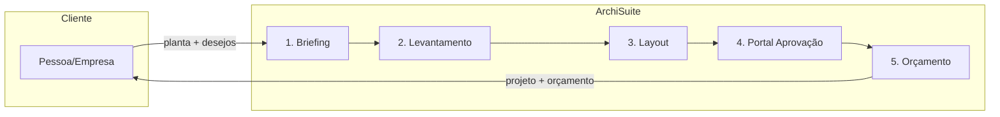

# ArchiSuite — Visão da Arquitetura

Visão de alto nível do fluxo e dos sistemas.

## Fluxo do serviço

1. **Cliente** entrega planta e descreve o que quer.
2. **Briefing** — IA extrai estilo, restrições, palavras-chave (texto/áudio).
3. **Levantamento** — Upload de PDFs/DWGs; base centralizada de medidas.
4. **Layout** — IA gera opções de planta otimizadas (móveis, circulação).
5. **Portal** — Cliente aprova visualmente e comenta em cima das imagens.
6. **Orçamento** — Quantitativo + busca de preços → orçamento atualizado.

## Sistemas (futuro)

| Área | Responsabilidade |
|------|-------------------|
| **Web app** | Painel interno: projetos, briefing, uploads, layout, orçamento. |
| **Portal do cliente** | Acesso por link; visualização e comentários nas imagens/3D. |
| **APIs / backend** | Autenticação, projetos, arquivos, chamadas de IA, orçamento. |
| **Storage** | Arquivos (plantas, renders) em nuvem; metadados em banco. |
| **IA** | NLP (briefing), otimização de layout, depois integrações de orçamento. |

## Decisões iniciais

- **Stack web:** Next.js (React) + TypeScript.
- **Backend:** Começar com API Routes do Next.js; depois separar (Lambda/Node ou FastAPI) se precisar.
- **Banco:** PostgreSQL na sua VM (local), seja instalado direto, em Docker ou em Kubernetes.
- **Arquivos:** Pasta local na VM (ex.: `UPLOADS_DIR`) para PDFs, DWGs, imagens — tudo local.
- **IA:** **Google Gemini** (SDK `@google/genai`), para NLP no briefing e depois layout; algoritmo próprio ou lib para otimização de planta.

Este doc será atualizado conforme o projeto evoluir.
